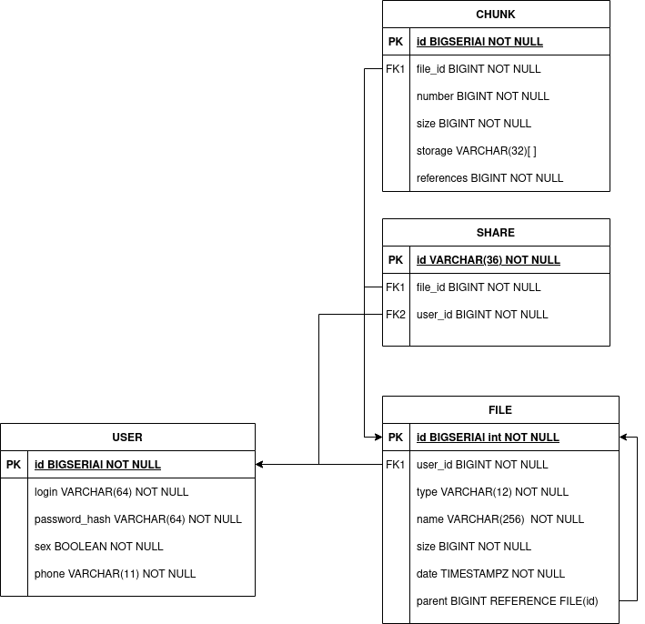

# HighloadArchitectureCourseWork

## 1. Выбор темы

В качестве темы был выбран сервис облачного хранения данных по типу [Dropbox](https://www.dropbox.com/) или [Yandex.Disk](http://disk.yandex.ru/).
У сервиса должны быть функции, такие как:

* загрузить файл
* удалить файл
* посмотреть информацию о файле
* поиск по директории
* поделиться ссылкой на файл

## 2. Определение возможного диапазона нагрузок

Положим количество пользователей сервиса равным 5М.

Сервис будет предоставлять 4гб дискового пространства для бесплатного аккаунта, 100гб для платного.
Ограничим объем загружаемых и скачиваемых данных для пользователя за день размером в 200% от его дискового пространства,
т.е. 8гб/день для бесплатного аккаунта, 200гб/день для платного.
Также положим, что 96% пользователей сервиса имеют бесплатный аккаунт, а 4% будут иметь платную подписку, т.е. платный аккаунт.
Исходя из этого, получмем следующие данные:

|account type|storage|percentage|daily traffic|total storage size                             |total daily traffic                                        |
|------------|-------|----------|-------------|-----------------------------------------------|-----------------------------------------------------------|
|free        |4GB    |96%       |8GB/day      |4GB * 0.96 * 5 * 10^6 = 76.8 * 10^6 GB = 19.2PB|38.4PB/day ~ 444.5GB/sec = 3 556 Gbit/sec ~= 3.556 Tbit/sec|
|paid        |100GB  |4%        |200GB/day    |100GB * 0.04 * 5 * 10^6 = 80 * 10^6GB = 20PB   |40PB/day ~ 463GB/sec = 3 704 Gbit/sec ~=  3.704 Tbit/sec   |

Из рассчетов получаем, что суммарных объем хранилища должен составлять 39.2PB.

Из данных [similarweb](https://www.similarweb.com/website/disk.yandex.ru/) и [tokar.ua](https://tokar.ua/read/9412) можно получить, что:

* средняя продолжительность пребывания на сайте такого проекта около 5 минут
* количество посещений на сайт примерно в 15 раз больше, чем количество пользователей, т.е. пользователь в среднем посещает ресурс 15 раз за месяц

## 3. Выбор планируемой нагрузки

## 4. Логическая схема базы данных

## 5.физическая системы хранения

В качестве хранения метаданных о файлах пользователей возьмем RocksDB, для хранилища ссылок возьмём PostgreSQL.

## 6. Прочие технологии (ЯП, протоколы взаимодействия, веб-сервера, ...)

## 7. Рассчет нагрузки и потребного оборудования

## 8. Выбор хостинга / облачного провайдера и расположения серверов

Для нужд такого сервиса катастрофически невыгодно пользоваться услугами облачного провайдера, поэтому будем делать всё своё.
Данные пользователей будем хранить в NAS хранилищах.

## 9. Cхема балансировки нагрузки

Будем использовать nginx L7 балансировку.

TODO: обязательная днс балансировка по round robin

## 10. Oбеспечение отказоустойчивости
